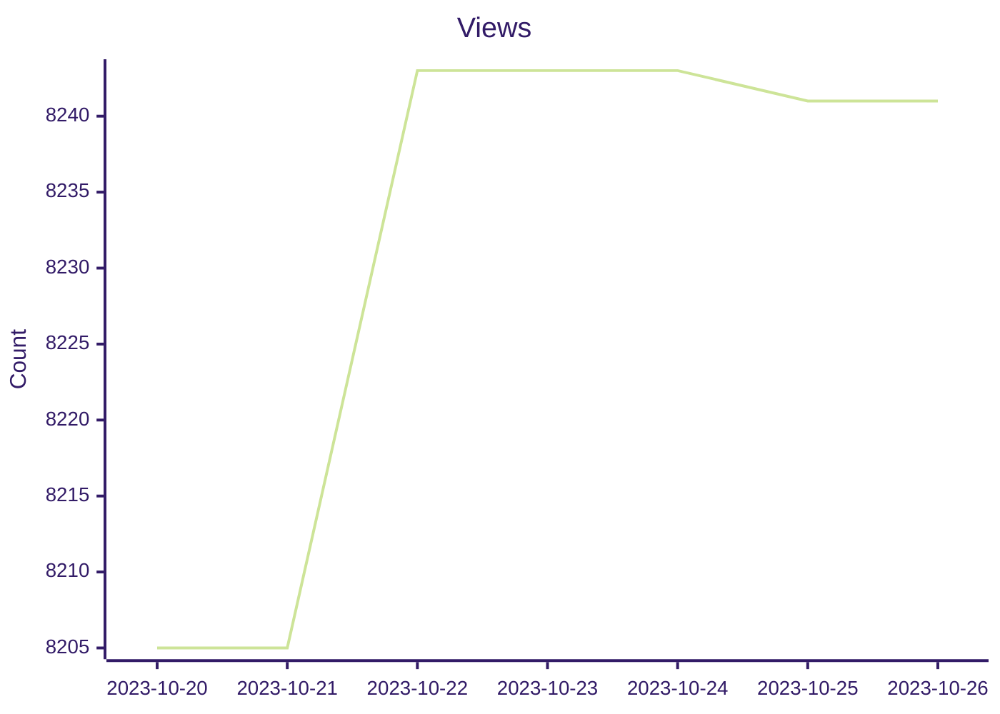

# Repo Traffic


### Repo Page Views


### Repo Unique Visitors
```mermaid
xychart-beta
    title "Views"
    x-axis ['2023-10-29', '2023-10-29', '2023-10-29', '2023-10-29', '2023-10-29', '2023-10-29', '2023-10-29', '2023-10-29', '2023-10-29', '2023-10-29', '2023-10-29', '2023-10-29', '2023-10-29', '2023-10-29', '2023-11-01', '2023-11-04', '2023-11-17', '2023-11-22', '2023-11-26', '2023-12-11', '2024-02-02', '2024-02-22', '2024-03-08', '2024-03-08', '2024-03-11', '2024-08-01', '2024-08-14', '2024-08-18', '2024-11-07', '2025-01-01', '2025-01-05', '2025-01-27', '2025-01-28', '2025-01-28']
    y-axis "Count"
    line ['599', '599', '601', '601', '601', '601', '601', '601', '601', '603', '603', '603', '603', '603', '610', '593', '548', '575', '579', '530', '540', '562', '599', '599', '569', '461', '408', '403', '460', '222', '165', '436', '438', '438']
    %%{init: {'theme':'forest'}}%%
```